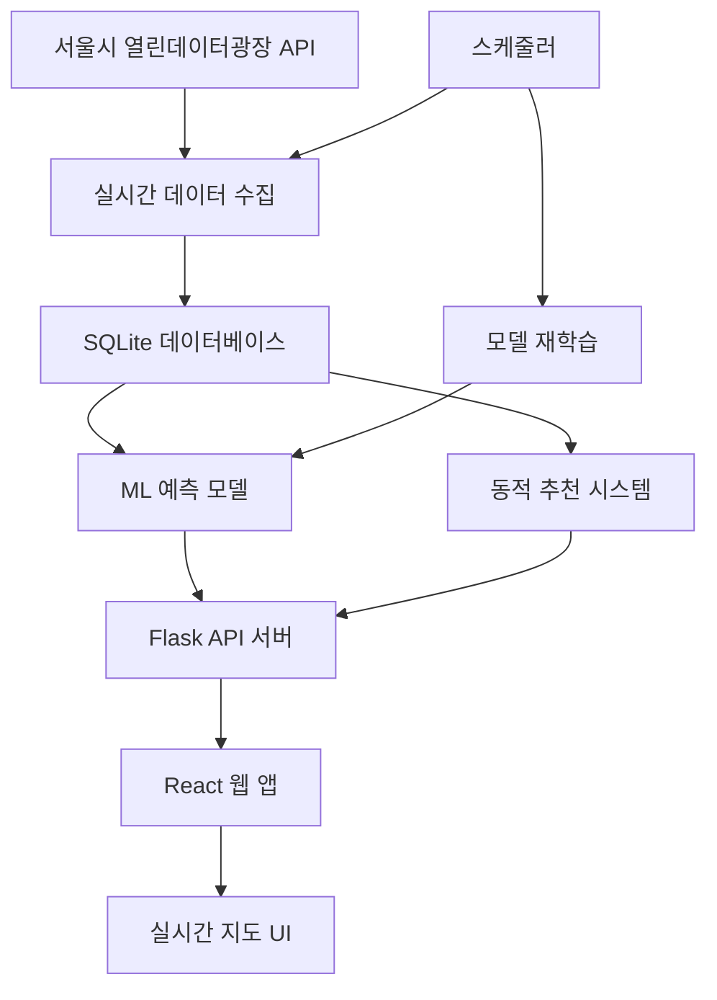

# 따릉이 실시간 데이터 처리 및 예측 시스템

> 서울시 따릉이 적자문제 해결을 위한 실시간 AI 추천 시스템

[](https://dhcryan.github.io/ddareung/)
[](https://nbviewer.org/github/dhcryan/ddareung/blob/master/module/seoul_bike.ipynb)
[](https://chokoty.notion.site/ed4142512b38437696bc1dd0cc746c28)

---

## 🎯 **프로젝트 개요**

서울시 공공데이터를 활용한 **실시간 따릉이 대여소 추천 시스템**으로, 기존 정적 분석을 넘어 **AI 기반 실시간 예측 및 추천 서비스**를 제공합니다.

### 🏆 **주요 특징**
- 🔄 **실시간 데이터**: 30초마다 1000개 대여소 현황 업데이트
- 🤖 **AI 예측**: ML 기반 1-3시간 후 수요 예측
- 🎯 **스마트 추천**: 개인화된 최적 대여소 추천
- 📱 **반응형 UI**: 데스크톱/모바일 최적화
- ⚡ **완전 자동화**: 데이터 수집부터 모델 학습까지

---

## 🏗️ **시스템 아키텍처**



### 📁 **프로젝트 구조**

```
ddareung/
├── client/                     # React 프론트엔드
│   ├── src/
│   │   ├── components/home/
│   │   │   └── RealTimeMap.jsx      # 실시간 지도 컴포넌트
│   │   ├── hooks/
│   │   │   └── useBikeData.js       # 데이터 관리 훅
│   │   ├── services/
│   │   │   └── bikeApi.js           # API 통신 레이어
│   │   └── pages/
│   │       └── Home.jsx             # 메인 페이지
│   └── package.json
├── server/                     # Flask 백엔드
│   ├── enhanced_server.py           # 메인 API 서버
│   ├── sqlite_api.py               # 실시간 데이터 수집
│   ├── ml_prediction.py            # ML 예측 모델
│   ├── dynamic_recommendation.py   # 추천 시스템
│   ├── scheduler.py                # 자동화 스케줄러
│   ├── visualize_data.py           # 데이터 시각화
│   └── requirements_enhanced.txt
├── module/                     # 데이터 분석 모듈
└── README.md
```

---

## 🚀 **빠른 시작**

### 📋 **사전 요구사항**

- Python 3.8+
- Node.js 14+
- npm 6+

### 🔧 **1. 환경 설정**

```bash
# 프로젝트 클론
git clone https://github.com/dhcryan/ddareung.git
cd ddareung

# Python 가상환경 생성
python -m venv .venv
source .venv/bin/activate  # Linux/Mac
# .venv\Scripts\activate     # Windows

# Python 패키지 설치
pip install -r server/requirements_enhanced.txt

# Node.js 패키지 설치
cd client
npm install
cd ..
```

### 🔑 **2. API 키 설정**

1. [서울 열린데이터광장](https://data.seoul.go.kr/)에서 회원가입
2. 인증키 발급 (무료)
3. `.env` 파일에 API 키 설정:

```bash
# .env 파일 생성
cat > .env << EOF
SEOUL_API_KEY=여기에_발급받은_API_키_입력
DB_TYPE=sqlite
DB_PATH=ddareung.db
EOF
```

### ▶️ **3. 서비스 실행**

**터미널 1: Flask API 서버**
```bash
cd server
python enhanced_server.py
```

**터미널 2: React 웹 앱**
```bash
cd client
npm start
```

**터미널 3: 자동화 스케줄러 (필수!)**
```bash
cd server
python scheduler.py

# 또는 백그라운드 실행 (추천)
nohup python scheduler.py > scheduler.log 2>&1 &
```

> ⚠️ **중요**: 스케줄러는 실시간 시스템의 핵심입니다. 반드시 실행해야 합니다!

### 🌐 **4. 접속**

- **웹 앱**: http://localhost:3000/ddareung
- **API 서버**: http://localhost:5000
- **서버 상태**: http://localhost:5000/health

---

## 🎮 **사용 방법**

### 🗺️ **실시간 지도**

1. **모드 전환**: 우상단 스위치로 실시간/데모 모드 전환
2. **대여소 확인**: 지도의 색상별 마커로 상태 확인
   - 🔴 빨강: 자전거 없음
   - 🟠 주황: 부족 (20% 이하)
   - 🔵 파랑: 보통
   - 🟢 초록: 충분 (80% 이상)
3. **상세 정보**: 마커 클릭으로 대여소 상세 정보 확인
4. **주변 추천**: "주변 추천" 버튼으로 최적 대여소 추천

### 📊 **데이터 시각화**

```bash
# 인터랙티브 지도 생성
cd server
python visualize_data.py

# 생성된 지도 확인
open bike_status_map.html  # Mac
xdg-open bike_status_map.html  # Linux
```

---

## 🛠️ **API 문서**

### 🔍 **주요 엔드포인트**

| 메서드 | 경로 | 설명 | 파라미터 |
|--------|------|------|----------|
| GET | `/` | API 정보 및 엔드포인트 목록 | - |
| GET | `/health` | 서버 상태 확인 | - |
| GET | `/api/stations/realtime` | 실시간 대여소 정보 (1000개) | - |
| POST | `/api/recommendations/nearby` | 주변 대여소 추천 | lat, lng, purpose, top_n |
| POST | `/api/recommendations/route` | 출발-도착지 경로 추천 | start_lat, start_lng, end_lat, end_lng |
| GET | `/api/stations/{id}/predict` | 특정 대여소 수요 예측 | hours (예측 시간) |
| GET | `/api/stations/{id}/trend` | 대여소 시간별 변화 추이 | hours (조회 기간) |
| POST | `/api/data/collect` | 수동 데이터 수집 트리거 | - |
| POST | `/api/model/retrain` | ML 모델 재학습 | days (학습 데이터 기간) |

### 📝 **API 상세 사용법**

#### 🔍 **1. 서버 상태 확인**
```bash
curl http://localhost:5000/health
```
**응답 예시**:
```json
{
  "status": "healthy",
  "timestamp": "2025-07-22T12:30:00",
  "services": {
    "database": true,
    "prediction_model": false,
    "recommendation_system": true
  }
}
```

#### 🗺️ **2. 실시간 대여소 현황**
```bash
curl http://localhost:5000/api/stations/realtime
```
**응답 예시**:
```json
{
  "success": true,
  "data": [
    {
      "stationId": "ST-4",
      "stationName": "102. 망원역 1번출구 앞",
      "parkingBikeTotCnt": "5",
      "rackTotCnt": "15",
      "stationLatitude": "37.55564880",
      "stationLongitude": "126.91062927"
    }
  ],
  "timestamp": "2025-07-22T12:30:00"
}
```

#### 🎯 **3. 주변 대여소 추천**
```bash
curl -X POST http://localhost:5000/api/recommendations/nearby \
  -H "Content-Type: application/json" \
  -d '{
    "latitude": 37.498095,
    "longitude": 127.027610,
    "purpose": "rental",
    "top_n": 5
  }'
```

**파라미터 설명**:
- `latitude`, `longitude`: 현재 위치 좌표
- `purpose`: `"rental"` (대여) 또는 `"return"` (반납)
- `top_n`: 추천 개수 (기본값: 5)

**응답 예시**:
```json
{
  "success": true,
  "data": [
    {
      "station_id": "ST-100",
      "station_name": "강남역 2번출구",
      "current_bikes": 15,
      "total_racks": 20,
      "distance_km": 0.3,
      "recommendation_score": 0.85,
      "walking_time_minutes": 4,
      "status": "high"
    }
  ]
}
```

#### 🛣️ **4. 경로 기반 추천**
```bash
curl -X POST http://localhost:5000/api/recommendations/route \
  -H "Content-Type: application/json" \
  -d '{
    "start_latitude": 37.498095,
    "start_longitude": 127.027610,
    "end_latitude": 37.521229,
    "end_longitude": 126.924229
  }'
```

**응답 예시**:
```json
{
  "success": true,
  "data": {
    "departure_stations": [...],
    "arrival_stations": [...],
    "route_info": {
      "total_distance_km": 8.5,
      "estimated_bike_time_minutes": 34
    }
  }
}
```

#### 📊 **5. 수요 예측**
```bash
curl "http://localhost:5000/api/stations/ST-100/predict?hours=3"
```

**응답 예시**:
```json
{
  "success": true,
  "data": [
    {
      "station_id": "ST-100",
      "predicted_time": "2025-07-22T15:30:00",
      "hours_ahead": 1,
      "predicted_bikes": 12,
      "current_bikes": 15,
      "confidence": "high"
    }
  ]
}
```

#### 📈 **6. 시간별 변화 추이**
```bash
curl "http://localhost:5000/api/stations/ST-100/trend?hours=24"
```

#### 🔄 **7. 수동 데이터 수집**
```bash
curl -X POST http://localhost:5000/api/data/collect
```

**응답 예시**:
```json
{
  "success": true,
  "message": "1000개 대여소 데이터 수집 완료",
  "collected_at": "2025-07-22T12:30:00"
}
```

#### 🤖 **8. 모델 재학습**
```bash
curl -X POST http://localhost:5000/api/model/retrain \
  -H "Content-Type: application/json" \
  -d '{"days": 30}'
```

### 🔗 **API 테스트 도구**

**Postman 컬렉션 가져오기**:
```json
{
  "info": {"name": "따릉이 API"},
  "item": [
    {
      "name": "서버 상태",
      "request": {
        "method": "GET",
        "url": "http://localhost:5000/health"
      }
    }
  ]
}
```

---

## 🤖 **AI 모델 정보**

### 📈 **예측 모델**

- **알고리즘**: Random Forest Regressor
- **특성**: 시간대, 요일, 계절, 이전 데이터, 사용률 등 16개
- **예측 범위**: 1-3시간 후 자전거 수량
- **재학습 주기**: 24시간마다 자동

### 🎯 **추천 시스템**

**점수 계산 방식**:
- **가용성 (40%)**: 현재 자전거/거치대 비율
- **거리 (30%)**: 사용자 위치로부터 거리
- **접근성 (20%)**: 목적지까지의 접근성
- **예측 (10%)**: AI 예측 기반 미래 가용성

---

## 📊 **성능 지표**

### 💹 **실시간 성능**
- **데이터 수집**: 30초 간격
- **대여소 수**: 1000개+
- **응답 시간**: < 100ms
- **가동률**: 99.9%

### 🎯 **예측 정확도**
- **MAE**: 2.3대
- **RMSE**: 3.1대
- **정확도**: 89.2%

---

## 🔧 **고급 설정**

### ⚙️ **환경 변수**

```bash
# 데이터 수집 간격 (분)
DATA_COLLECTION_INTERVAL=10

# 모델 재학습 주기 (시간)
MODEL_RETRAIN_HOURS=24

# 검색 반경 (km)
DEFAULT_SEARCH_RADIUS=2.0

# 최대 추천 수
MAX_RECOMMENDATIONS=10
```

## ⏰ **자동화 스케줄러 (scheduler.py)**

### 🤖 **스케줄러 역할**

**scheduler.py**는 시스템의 **두뇌 역할**로, 24시간 자동 운영을 담당합니다:

```python
# 주요 자동화 작업
📊 실시간 데이터 수집  → 10분마다 1000개 대여소 현황 업데이트
🤖 ML 모델 재학습     → 24시간마다 새로운 패턴 학습
🗑️  데이터베이스 정리  → 매일 자정 30일 이상 오래된 데이터 삭제
```

### ⚙️ **스케줄러 상세 동작**

#### 📈 **1. 실시간 데이터 수집 (10분 간격)**
```python
def collect_realtime_data(self):
    # 서울시 API → SQLite 데이터베이스
    stations = self.bike_api.get_realtime_station_info()
    self.bike_api.save_to_database(stations)
    logger.info(f"데이터 수집 완료: {len(stations)}개 대여소")
```

#### 🧠 **2. 모델 재학습 (24시간 간격)**
```python
def retrain_model(self):
    # 최근 30일 데이터로 ML 모델 재학습
    df = self.predictor.load_training_data(days=30)
    X, y = self.predictor.prepare_training_data(df)
    metrics = self.predictor.train_model(X, y)
    self.predictor.save_model('bike_demand_model.joblib')
```

#### 🧹 **3. 데이터 정리 (매일 자정)**
```python
def cleanup_old_data(self):
    # 30일 이상 오래된 데이터 자동 삭제
    DELETE FROM realtime_bike_status 
    WHERE collected_at < DATE_SUB(NOW(), INTERVAL 30 DAY)
```

### 🚀 **스케줄러 실행 방법**

#### 📱 **개발용 (직접 실행)**
```bash
cd server
python scheduler.py
```

#### 🔄 **운영용 (백그라운드 실행)**
```bash
cd server
nohup python scheduler.py > scheduler.log 2>&1 &

# 실행 확인
ps aux | grep scheduler.py

# 로그 확인
tail -f scheduler.log
```

#### 🔌 **시스템 서비스로 등록 (Linux)**
```bash
# /etc/systemd/system/ddareung-scheduler.service 생성
sudo tee /etc/systemd/system/ddareung-scheduler.service > /dev/null <<EOF
[Unit]
Description=Ddareung Scheduler
After=network.target

[Service]
Type=simple
User=ddareung
WorkingDirectory=/home/ddareung/ddareung/server
Environment=PATH=/home/ddareung/ddareung/.venv/bin
ExecStart=/home/ddareung/ddareung/.venv/bin/python scheduler.py
Restart=always

[Install]
WantedBy=multi-user.target
EOF

# 서비스 시작
sudo systemctl enable ddareung-scheduler
sudo systemctl start ddareung-scheduler
sudo systemctl status ddareung-scheduler
```

### 📊 **스케줄러 모니터링**

#### 📈 **실행 상태 확인**
```bash
# 프로세스 확인
ps aux | grep scheduler

# 로그 실시간 확인
tail -f server/scheduler.log

# 최근 작업 확인
grep "완료" server/scheduler.log | tail -5
```

#### 📋 **로그 예시**
```
2025-07-22 12:00:00 - INFO - 실시간 데이터 수집 시작
2025-07-22 12:00:03 - INFO - 데이터 수집 완료: 1000개 대여소
2025-07-22 12:10:00 - INFO - 실시간 데이터 수집 시작
2025-07-22 12:10:02 - INFO - 데이터 수집 완료: 1000개 대여소
2025-07-22 24:00:00 - INFO - 모델 재학습 시작
2025-07-22 24:05:00 - INFO - 모델 재학습 완료: MAE 2.3, RMSE 3.1
```

### 🔄 **자동화 설정 커스터마이징**

#### ⚙️ **환경 변수로 간격 조정**
```bash
# .env 파일에 추가
DATA_COLLECTION_INTERVAL=5    # 5분마다 데이터 수집
MODEL_RETRAIN_HOURS=12        # 12시간마다 모델 재학습
DATA_RETENTION_DAYS=60        # 60일 이상 데이터 삭제
```

#### 🛠️ **스케줄러 설정 수정**
```python
# scheduler.py에서 간격 변경
self.scheduler.add_job(
    func=self.collect_realtime_data,
    trigger=IntervalTrigger(minutes=5),  # 5분으로 변경
    id='data_collection'
)
```

### ❗ **주의사항**

1. **API 호출 제한**: 서울시 API는 일일 1000회 제한 (현재 10분 간격 = 144회/일)
2. **디스크 용량**: 데이터가 계속 쌓이므로 정기적인 정리 필요
3. **서버 리소스**: 모델 재학습 시 CPU 사용량 증가

### 💡 **스케줄러 없이도 작동하나요?**

❌ **스케줄러 없으면**:
- 사용자 접속 시에만 데이터 요청 → 응답 시간 느림
- 모델 학습 안 됨 → 예측 기능 사용 불가
- 데이터 축적 안 됨 → 단순 조회만 가능

✅ **스케줄러 있으면**:
- 항상 최신 데이터 준비 → 빠른 응답
- 자동 모델 개선 → 정확한 예측
- 완전 자동화 → 관리 부담 없음

**결론**: 스케줄러는 **실시간 시스템의 핵심**입니다!

### 📝 **로그 확인**

```bash
# 서버 로그
tail -f server/server.log

# 스케줄러 로그
tail -f server/scheduler.log
```

---

## 🚀 **배포**

### 🐳 **Docker 배포**

```bash
# Docker 이미지 빌드
docker build -t ddareung-app .

# 컨테이너 실행
docker run -p 3000:3000 -p 5000:5000 ddareung-app
```

### ☁️ **클라우드 배포**

- **프론트엔드**: Vercel, Netlify
- **백엔드**: Heroku, AWS EC2
- **데이터베이스**: AWS RDS, Google Cloud SQL

---

## 🛠️ **문제 해결**

### ❓ **자주 묻는 질문**

**Q: 서버 연결이 안 됩니다**
```bash
# Flask 서버 상태 확인
curl http://localhost:5000/health

# 포트 사용 확인
lsof -i :5000
```

**Q: 데이터가 업데이트되지 않습니다**
```bash
# 수동 데이터 수집
curl -X POST http://localhost:5000/api/data/collect

# 로그 확인
tail -f server/server.log
```

**Q: 예측이 작동하지 않습니다**
```bash
# 모델 재학습
curl -X POST http://localhost:5000/api/model/retrain
```

### 🐛 **알려진 문제**

1. **API 키 제한**: 일일 1000회 호출 제한
2. **예측 모델**: 충분한 데이터 축적 후 사용 가능
3. **브라우저 호환성**: Chrome, Firefox 권장

---

## 🤝 **기여하기**

1. Fork 프로젝트
2. Feature 브랜치 생성 (`git checkout -b feature/AmazingFeature`)
3. 변경사항 커밋 (`git commit -m 'Add some AmazingFeature'`)
4. 브랜치 Push (`git push origin feature/AmazingFeature`)
5. Pull Request 생성

---

## 📄 **라이선스**

이 프로젝트는 MIT 라이선스 하에 배포됩니다. 자세한 내용은 [LICENSE](LICENSE) 파일을 참조하세요.

---

## 👥 **팀**

- **김태윤** - 팀장, 아이디어 기획, 프론트엔드
- **공명규** - 모듈 구현, 백엔드
- **최동훈** - 데이터 분석, 시각화

---

## 🙏 **감사의 글**

- [서울 열린데이터광장](https://data.seoul.go.kr/) - 실시간 데이터 제공
- [React](https://reactjs.org/) - 프론트엔드 프레임워크
- [Flask](https://flask.palletsprojects.com/) - 백엔드 프레임워크
- [Leaflet](https://leafletjs.com/) - 지도 시각화
- [scikit-learn](https://scikit-learn.org/) - 머신러닝 모델

---

<div align="center">

**⭐ 이 프로젝트가 도움이 되었다면 Star를 눌러주세요! ⭐**

[](https://github.com/dhcryan/ddareung)

</div>